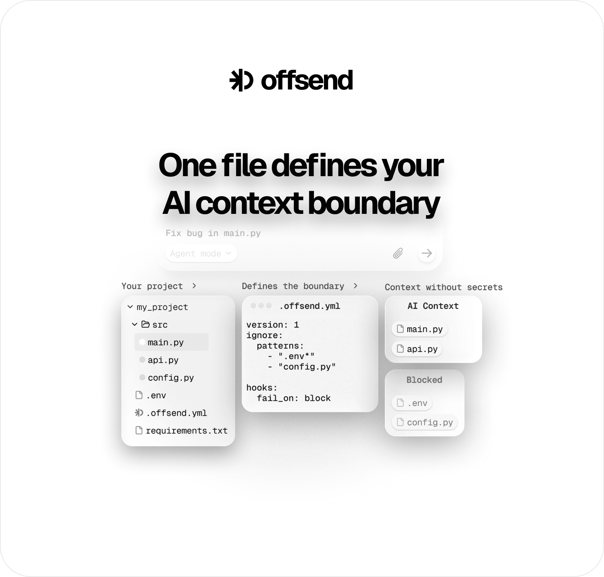

<p align="center">
  
</p>

<p align="center">
  See and fix what AI tools can read.<br>
  One <code>.offsend.yml</code> in the repo — shared by the team and CI — before Claude Code, Codex, Cursor, or Windsurf see your context.
</p>

<p align="center">
  <a href="https://offsend.io">Website</a> ·
  <a href="#quick-start">Quick Start</a> ·
  <a href="#mcp-seal">MCP seal</a> ·
  <a href="docs/README.md">Docs</a> ·
  <a href="https://check.offsend.io">Check</a> ·
  <a href="https://offsend.io/extension">Extension</a>
</p>

<p align="center">
  <a href="https://github.com/Offsend/Offsend/actions/workflows/ci.yml"></a>
  <a href="https://github.com/Offsend/Offsend/releases"></a>
  <a href="LICENSE"></a>
  
  <a href="https://www.apple.com/macos/"></a>
  
  <a href="https://radar.offsend.io/participants/"></a>
</p>

---

`.gitignore` protects Git. It does not define what AI tools should read.

Offsend is that missing layer: put the AI context boundary in **one `.offsend.yml`**, commit it with the code, and let the whole team inherit the same rules. Offsend materializes `.cursorignore`, `.claudeignore`, `.aiexclude`, and the rest, runs local checks, and can fail CI when secrets or ignore drift show up. Everything runs **locally** — no cloud account, no upload of file contents for analysis. The CLI is free and open source.

No install yet? [Scan a public GitHub repo with Check](https://check.offsend.io).

## What Offsend does

| Layer | Job | Commands |
| --- | --- | --- |
| **Boundary** | Shared path rules in `.offsend.yml`; sync to AI ignore files; catch drift | `show`, `protect`, `ignore`, `sync`, `doctor` |
| **Content** | Scan files, staged diffs, or stdin for secrets and custom terms | `check` |
| **Team / CI** | Same boundary on every PR; fail when secrets or ignore drift appear | [GitHub Action](https://offsend.io/github-action), `check --policy` |
| **Runtime** | Gate prompts, reads, shell, MCP; **seal** secrets in MCP responses / denied reads; audit agent history | `sync`, `hook install`, `keygen`, `seal` / `unseal`, `history` |

Defense-in-depth: ignore files first, then hooks. Hooks do not replace keeping secrets out of the workspace — see [what hooks cover](docs/cli.md#what-hooks-cover).

## Quick Start

```bash
curl -fsSL https://install.offsend.io/cli | bash
offsend doctor
offsend show
```

When sensitive paths are exposed:

```text
Scanned: /path/to/project
3 files exposed to AI tools — usable in further read/shell/MCP steps (2 required, 1 recommended):

✗ Environment files [required]
    Ignore .env and .env.* files.
  - .env

✗ PEM keys [required]
    Ignore PEM key files.
  - server.pem
```

### Team path (recommended)

```bash
# once per repo — commit .offsend.yml so everyone shares the boundary
offsend init --template node   # .offsend.yml + ignore files + baseline check (advise-only)
offsend protect                # promote exposed paths to .offsend.yml, sync AI ignore files
git add .offsend.yml && git commit -m "Add AI context policy"
# add the GitHub Action so PRs fail on secrets / ignore drift (see below)

# every clone
offsend sync                   # materialize AI ignore files + install hooks
```

Rules live in `.offsend.yml` — that file is the source of truth. AI ignore files are generated artifacts and stay out of git by default (`ignore.commit: false`). Teammates do not copy `.cursorignore` by hand; they run `sync`. Full walkthrough: [Add Offsend to a team repo](docs/team.md).

### Already leaked into local agent history?

```bash
offsend history audit                 # find secrets in Cursor/Claude transcripts
offsend history scrub --apply         # redact findings (close agent sessions first)
offsend doctor                        # next steps if ignore files or hooks are missing
```

Other installs: [CLI docs → Install](docs/cli.md#install) · macOS app: `brew install --cask offsend/tap/offsend`

## MCP seal

MCP tools can return secrets into model context. With **seal**, Offsend swaps those values for reversible `{{TYPE:v1.…}}` tokens in the tool **response** before Cursor or Claude sees them — the agent keeps working; plaintext stays out of context. Restore later with `offsend unseal`.

Default response mode is `observe` (log only). Sealing is opt-in:

```bash
# 1. Once per machine — personal key (not committed)
offsend keygen --default          # → ~/.offsend/seal.key
```

```yaml
# 2. In the repo .offsend.yml
context:
  mcp:
    responses: seal               # observe | warn | seal
```

```bash
# 3. Install / refresh gates (MCP response gate is on by default for Cursor + Claude)
offsend sync
offsend doctor                    # warn if key or responses: seal is missing
```

Without a key, secret-bearing responses are **withheld** (not passed through). Related: `context.read.on_secret: seal` hands the agent a sealed copy when a file read is denied. Depth: [MCP-response-gate](docs/cli.md#mcp-response-gate-on-by-default) · [configuration](docs/configuration.md#contextmcp).

## Pick your tool

| Tool | Best for |
| --- | --- |
| **[CLI](docs/cli.md)** | Repos, git hooks, AI-editor gates, CI (macOS & Linux) |
| **[macOS app](docs/macos-app.md)** | Safe Paste, drag-and-drop prep, watched folders |
| **[Check](https://check.offsend.io)** | One-off scan of a public GitHub repo |
| **[GitHub Action](https://offsend.io/github-action)** | Fail PRs on secrets, exposed paths, or ignore drift |
| **[Extension](https://offsend.io/extension)** | Mask secrets in ChatGPT, Claude, Gemini, and similar chats |

## CLI essentials

| Command | Purpose |
| --- | --- |
| `offsend show` | Sensitive paths visible to AI (+ MCP inventory, agent-history hint, ignore drift) |
| `offsend sync` | Apply `.offsend.yml`: materialize AI ignore files + install hooks (post-clone, idempotent) |
| `offsend protect` | Promote exposed paths to `.offsend.yml` and sync AI ignore files |
| `offsend ignore` | Add ignore patterns to `.offsend.yml` (auto-materializes; use `sync` after hand-edits) |
| `offsend check` | Scan contents (files, `--staged`, stdin, or editor hook JSON) |
| `offsend hook install` | Git pre-commit + prompt / read / shell / MCP / subagent gates |
| `offsend keygen --default` | Personal seal key for MCP / read seal modes |
| `offsend seal` / `unseal` | Replace secrets with tokens / restore plaintext |
| `offsend history audit` | Find secrets already written into local Cursor/Claude transcripts |
| `offsend doctor` | Verify install, hooks, ignore drift, MCP policy, seal key, next steps |

```bash
# CI — fail the PR when secrets or managed ignore drift appear
- uses: Offsend/ai-hygiene@v1
  with:
    fail-on: block
```

## Privacy

- Scanning and audits run on your machine.
- Offsend does not upload scanned file contents, prompts, clipboard payloads, or findings.
- Check only analyzes a GitHub repo you choose to scan online.

## Docs

Essentials above; reference depth in `docs/`:

| Doc | Description |
| --- | --- |
| [docs/README.md](docs/README.md) | Index and suggested reading path |
| [docs/team.md](docs/team.md) | Add Offsend to a team repository |
| [docs/cli.md](docs/cli.md) | Commands, flags, exit codes, AI-editor hooks (incl. MCP seal) |
| [docs/configuration.md](docs/configuration.md) | `.offsend.yml` reference (`check`, `ignore`, `hooks`, `context`) |
| [docs/faq.md](docs/faq.md) | FAQ, coverage limits, privacy |
| [docs/macos-app.md](docs/macos-app.md) | Desktop app, Free vs Pro, App vs CLI |
| [.offsend.yml.example](.offsend.yml.example) | Annotated config starter |
| [docs/positioning.md](docs/positioning.md) | ICP and messaging (internal) |
| [SECURITY.md](SECURITY.md) | Vulnerability reporting |

## Contributing

Bug reports, feature requests, docs improvements, and PRs are welcome.

- Open an [issue](https://github.com/Offsend/Offsend/issues)
- Read [SECURITY.md](SECURITY.md) before reporting a vulnerability
- Keep changes focused and explain the user problem they solve

## License

Apache 2.0 — see [LICENSE](LICENSE).
