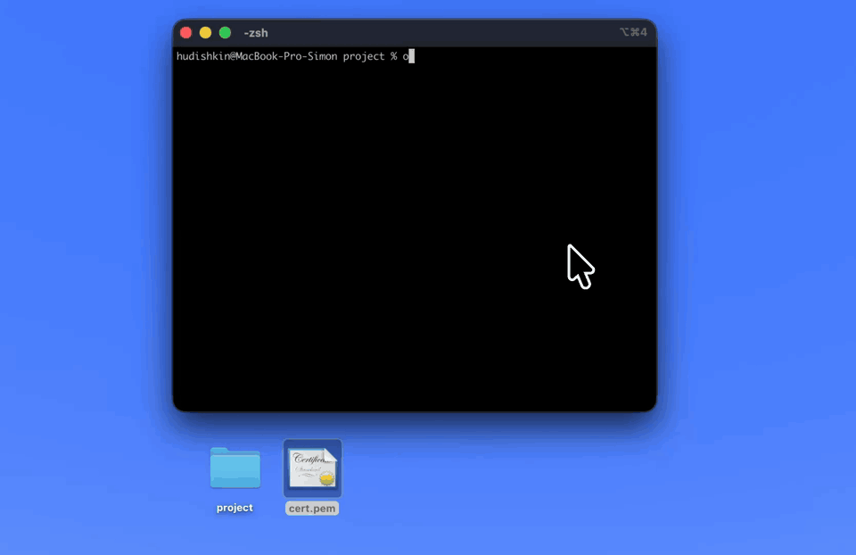
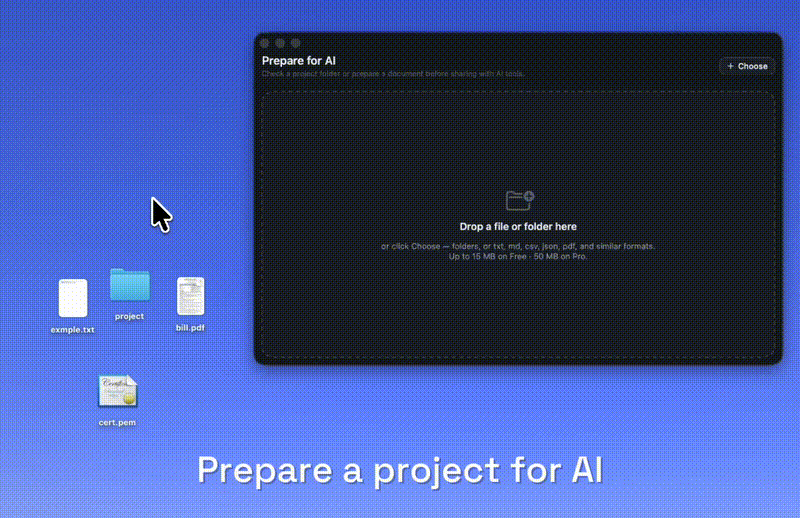
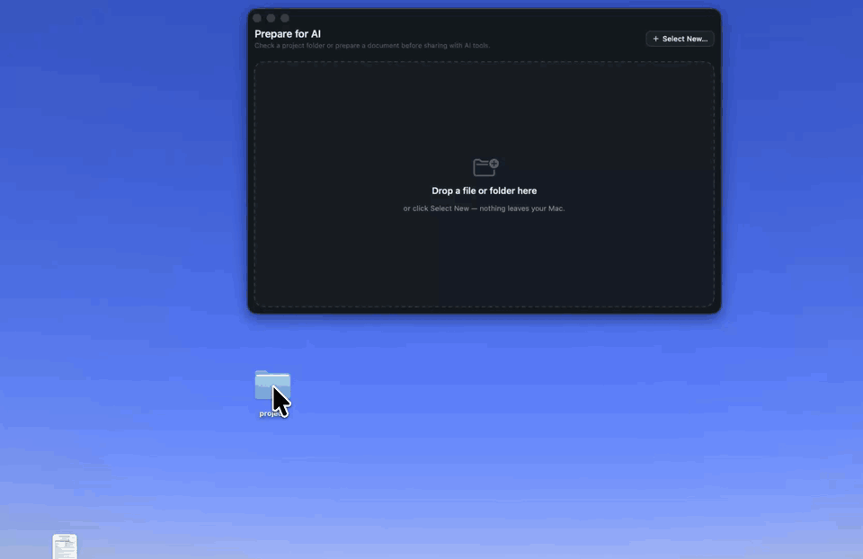
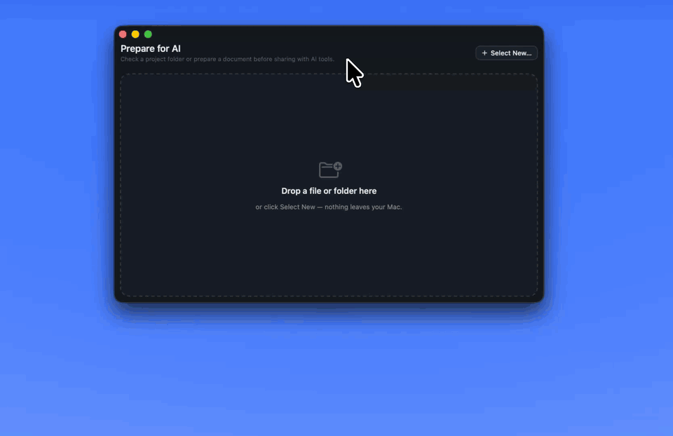
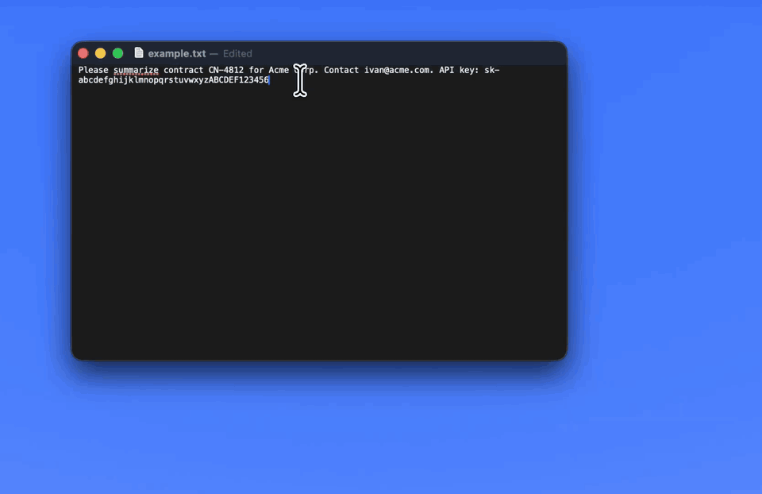

<h1 align="center"><code>*}• Offsend</code></h1>

<p align="center">
  See and fix what AI tools can read.<br>
  Local-first privacy checks for terminals, CI, and macOS — before Claude Code, Codex, Cursor, or Windsurf see your context.
</p>

<p align="center">
  <a href="https://offsend.io">Website</a> ·
  <a href="#quick-start">Quick Start</a> ·
  <a href="docs/cli.md">Docs</a> ·
  <a href="#cli">CLI</a> ·
  <a href="#macos-app">macOS App</a> ·
  <a href="https://check.offsend.io">Check</a> ·
  <a href="https://offsend.io/extension">Extension</a>
</p>

<p align="center">
  <a href="https://github.com/Offsend/Offsend/actions/workflows/ci.yml"></a>
  <a href="https://github.com/Offsend/Offsend/releases"></a>
  <a href="LICENSE"></a>
  
  <a href="https://www.apple.com/macos/"></a>
  
  
  <a href="https://radar.offsend.io/participants/"></a>
</p>

<p align="center">
  
</p>

---

Offsend adds a local review step before sensitive data reaches an AI tool.

- Scanning runs locally on your machine.
- Code and file contents are not uploaded for analysis.
- No cloud account is required.
- The CLI is free and open source.

AI tools need context, but that context can accidentally include API keys, client data, private endpoints, certificates, or config files.

`.gitignore` protects Git. It does not define what AI tools should read.

No install yet? [Scan a public GitHub repo with Check](https://check.offsend.io) — free, no signup.

## Why Offsend

AI workflows create a new boundary problem.

A file does not need to be committed or publicly exposed to become AI context. It can reach an AI tool through a prompt, project index, coding assistant, uploaded document, clipboard, or Git diff.

Offsend helps review that context locally before it leaves your control.

**Platforms:** CLI on macOS and Linux (x86_64 / arm64) · macOS app on macOS 13+ · GitHub Action on Linux and macOS runners.

## Pick your workflow

| Tool | Purpose | Link |
| --- | --- | --- |
| **CLI** | Terminal, git hooks, AI-editor hooks, and CI on **Linux & macOS** (free) | [Quick Start](#quick-start) · [CLI docs](docs/cli.md) |
| **macOS app** | Safe Paste, drag-and-drop prep, watched folders | [Desktop](#macos-app) |
| **Check** | Free online scan of a public GitHub repo | [check.offsend.io](https://check.offsend.io) |
| **GitHub Action** | Same CLI checks on every PR / push | [ai-hygiene](https://offsend.io/github-action) |
| **Browser Extension** | Mask secrets in ChatGPT, Claude, Gemini, Grok, Perplexity, DeepSeek | [Extension](https://offsend.io/extension) |
| **Radar** | Research AI-context exposure across public repos | [radar.offsend.io](https://radar.offsend.io) |

**Use the CLI** if you need repository checks, git hooks, AI prompt gates (Cursor / Claude / Windsurf / Codex), CI, or scripts.  
**Use the macOS app** if you regularly prepare files, projects, or clipboard text before sending them to AI.

---

## Quick Start

### Free CLI (macOS + Linux)

The package is `offsend-cli`; the command is `offsend`.

```bash
curl -fsSL https://install.offsend.io/cli | bash
offsend doctor
offsend show
```

Example when sensitive paths are exposed:

```text
Scanned: /path/to/project
3 files would be sent to AI tools (2 required, 1 recommended):

✗ Environment files [required]
    Ignore .env and .env.* files.
  - .env

✗ PEM keys [required]
    Ignore PEM key files.
  - server.pem

! SSH material [recommended]
    Ignore SSH directories and id_rsa files.
  - id_rsa
```

`offsend show` is read-only (paths and ignore rules only). Next:

```bash
offsend prepare
offsend hook install              # git pre-commit → offsend check --staged
offsend check --staged
```

Optional: [AI-editor prompt hooks](docs/cli.md#ai-editor-hooks) before prompts reach Cursor, Claude, Windsurf, or Codex:

```bash
offsend hook install --target cursor
offsend hook status --target all
```

Full command reference: [docs/cli.md](docs/cli.md).

Or skip install and [scan a repo online with Check](https://check.offsend.io).

### macOS app

```bash
brew install --cask offsend/tap/offsend
```

Or download the latest `.dmg` from [Releases](../../releases). Drop in a file or project, review findings, mask sensitive data, then copy or save the AI-ready result.

## Contents

- [Pick your workflow](#pick-your-workflow)
- [Quick Start](#quick-start)
- [CLI](#cli)
- [macOS App](#macos-app)
- [More of the Offsend toolkit](#more-of-the-offsend-toolkit)
- [Privacy](#privacy)
- [FAQ](#faq)
- [Docs](#docs)
- [Contributing](#contributing)

See also: [CLI reference](docs/cli.md) · [Configuration](docs/configuration.md)

---

## CLI

Free for local checks, git hooks, and CI on **macOS and Linux** (x86_64 and arm64).

The macOS app also ships a bundled `offsend` helper (`Offsend.app/Contents/Helpers/offsend`). Put it on `PATH` from **Settings → Hooks → CLI** — it will not overwrite an existing Homebrew `offsend`.

### Two types of checks

**Content scanning** — `offsend check` scans files or staged changes for API keys, tokens, private keys, personal data, and custom terms.

**AI-context boundary checks** — `offsend show` and `offsend prepare` inspect paths and AI ignore rules. They do not read the contents of matched files.

**AI prompt gates** — `offsend hook install --target cursor|claude|windsurf|codex` checks prompts via editor hooks before they leave the IDE. See [AI editor hooks](docs/cli.md#ai-editor-hooks).

### Commands

| Command | What it does |
| --- | --- |
| `offsend doctor` | Verify the installation |
| `offsend show` | Show sensitive paths visible to AI tools |
| `offsend prepare` | Create missing AI ignore files |
| `offsend ignore` | Add a path or pattern to every AI ignore file |
| `offsend check` | Scan files or folders |
| `offsend check --staged` | Scan staged Git changes |
| `offsend hook install` | Install a pre-commit or AI-editor hook |
| `offsend hook status` | Check hook status (`--target all` for AI editors) |
| `offsend hook uninstall` | Remove the hook |
| `offsend init` | Create a starter `.offsend.yml` (`--template`, `--merge-exclude`, `--list-templates`) |
| `offsend edit` | Open `.offsend.yml` in your editor |
| `offsend seal` / `unseal` | Reversible seal tokens for sensitive text |
| `offsend keygen` | Generate a seal key |
| `offsend report` | Anonymized JSON hygiene report |

Full command reference: **[docs/cli.md](docs/cli.md)** (includes AI-editor hooks for Cursor, Claude, Windsurf, Codex).

### Typical repository workflow

```bash
offsend show                 # what can AI tools read?
offsend prepare --dry-run    # preview ignore files
offsend prepare              # create missing AI ignore files
offsend init --template node # optional project config — see docs/configuration.md
offsend check --staged       # scan before commit
offsend hook install         # git hook + AI-editor hooks for detected editors
```

### Examples

```bash
# Boundary checks
offsend show
offsend show --format json
offsend prepare --sync-patterns
offsend ignore secrets/ '*.pem'   # add patterns to every AI ignore file

# Content scans
offsend check README.md Sources/
offsend check --staged --format json --quiet   # add --verbose for every finding

# Full protection: git pre-commit hook + AI-editor hooks (prompt gate + read gate)
offsend hook install --path /path/to/your/repo
offsend hook status

# Narrower installs
offsend hook install --target git                     # git hook only
offsend hook install --target cursor                  # one editor
offsend hook install --target claude --no-read-gate   # opt out of the read gate
offsend hook install --target cursor --shell-gate     # opt-in shell-command gate (ask)
offsend hook install --target all                     # all four editors
```

`offsend show` exits `0` even when files are exposed (`2` if the directory is unavailable). `offsend prepare` never overwrites existing ignore files (`.cursorignore`, `.claudeignore`, `.aiexclude`, `.geminiignore`, …). The **git** hook runs `offsend check --staged`; **AI** hooks call `offsend check --adapter …` (see [docs/cli.md](docs/cli.md)).

**CI**

```yaml
- uses: actions/checkout@v4
- uses: Offsend/ai-hygiene@v1
  with:
    fail-on: block
```

Or install the CLI and run `offsend check --staged` yourself.

### Configuration

```bash
offsend init --template node
# aliases: js/ts → node, ios → swift; also: python, go, rust, ruby, java, android, swift, tuist
# offsend init --list-templates
# offsend init --template python --merge-exclude
```

```yaml
version: 1

check:
  fail_on: block
  policy: false
  exclude:
    - "*.lock"
    - ".DS_Store"
    - "Thumbs.db"
    - "Desktop.ini"
    - "**/dist/**"
    - "**/build/**"
    - "**/coverage/**"
    - "*.map"
    - "*.min.js"
    - "*.min.css"
    - ".eslintcache"
    - ".stylelintcache"
    - "**/node_modules/**"
  detectors:
    disable:
      - phone
  dictionaries:
    - kind: project
      value: "Project Apollo"

hooks:
  type: pre-commit
  fail_on: block
  policy: false
```

Full reference: **[docs/configuration.md](docs/configuration.md)**.

### Install options

```bash
# Homebrew — macOS (cask) / Linux (formula)
brew install --cask offsend/tap/offsend-cli   # macOS
brew install offsend/tap/offsend-cli          # Linux

# No root
OFFSEND_INSTALL_DIR=$HOME/.local/bin OFFSEND_PREFIX=$HOME/.local/lib/offsend/cli \
  curl -fsSL https://install.offsend.io/cli | bash

# Docker
docker build -f CLI/Dockerfile -t offsend/cli .
docker run --rm -v "$PWD:/work" -w /work offsend/cli check README.md

# From source (Swift 6.0+)
swift build --product offsend -c release
.build/release/offsend doctor
```

Pin a release with `OFFSEND_VERSION=…`. On Linux, config lives under `$XDG_CONFIG_HOME/offsend` (typically `~/.config/offsend`). On macOS CLI, settings use Application Support / Keychain like the app.

---

## macOS App

Interactive workflow on Mac: Safe Paste, drag-and-drop file preparation, project audits, watched folders, local AI detection, and hook management UI.

<p align="center">
  
</p>

### Install

```bash
brew install --cask offsend/tap/offsend
```

Or download the latest `.dmg` from [Releases](../../releases).

**Build from source** — macOS 13+, Xcode 16, Tuist:

```bash
brew install tuist
./Scripts/bootstrap.sh
open Offsend.xcworkspace
```

macOS may ask for Accessibility (to paste into the front app) and folder access (to audit and monitor directories).

### What you can do

**Prepare a project** — audit ignore files and sensitive paths, one-click fixes, optional watched folders. Paths and ignore rules only — not file contents. Works with `.cursorignore`, `.copilotignore`, `.claudeignore`, `.aiexclude`, and similar.

<p align="center">
  
</p>

**Prepare files** — drop a file, review findings, mask or redact, then copy or save. Plain text plus `.pdf`, `.rtf`, `.doc`, `.docx`.

<p align="center">
  
</p>

**Safe Paste** — `⌘⇧V` scans and pastes a masked clipboard; `⌘⇧R` restores originals. Mappings are encrypted on disk; the key lives in Keychain.

<p align="center">
  
</p>

**Git hooks** — **Settings → Hooks** to install and manage pre-commit checks. From the terminal: [`offsend hook install`](docs/cli.md#hook-install) (git) or [`--target cursor|claude|…`](docs/cli.md#ai-editor-hooks) for AI-editor hooks.

**Detection & local AI** — toggle built-in detectors and custom dictionaries in **Settings → Detection** (also via `.offsend.yml`). Optional NER/PII models in **Settings → AI** stay on your Mac.

### App vs CLI

| | **CLI (macOS / Linux)** | **macOS app** |
| --- | --- | --- |
| Best for | Terminal, hooks, CI | Daily interactive work |
| Safe Paste | No | Yes |
| File preparation | Path-based scans | Drag-and-drop UI, review, copy/save |
| Documents | Plain text (+ PDF/RTF/Word on macOS CLI) | Plain text, PDF, RTF, Word |
| Project checks | `show`, `prepare`, `check --policy` | UI checks, watched folders |
| Git hooks | `offsend hook …` | Settings → Hooks |
| AI prompt hooks | `hook install --target …` ([docs](docs/cli.md#ai-editor-hooks)) | — |
| AI models | Not used by the CLI | Download / import / manage |
| Automation | Scriptable text / JSON | Background watcher + notifications |

### Free vs Pro

The core protection workflow is free. Pro adds unlimited watched folders and longer restore windows.

| | **Free** | **Pro** |
| --- | --- | --- |
| Safe Paste & built-in detectors | Unlimited | Unlimited |
| Directory audit & one-click fixes | Full | Full |
| CLI for terminal, hooks & CI | Yes | Yes |
| Hook management UI | Yes | Yes |
| Custom dictionaries (incl. regex) | Yes | Yes |
| Watched folders | 1 | Unlimited |
| Mapping TTL | 1 hour | Up to 24 hours |

---

## More of the Offsend toolkit

### [Check](https://check.offsend.io) — scan a GitHub repo online

Paste a public GitHub URL. Exposed secrets, risky configs, missing AI ignore rules — no signup. Full file paths stay hidden in the report.

### [GitHub Action](https://offsend.io/github-action) — CI gate

[`Offsend/ai-hygiene`](https://github.com/Offsend/ai-hygiene) runs `offsend check` on PRs and pushes. Same `.offsend.yml` as local runs.

### [Browser Extension](https://offsend.io/extension) — protect prompts

Chrome / Firefox: ChatGPT, Claude, Gemini, Grok, Perplexity, DeepSeek — mask before send.

### [Radar](https://radar.offsend.io) — exposure research

AI-context risk signals across public repos, without reading file contents or publishing exact paths.

---

## Privacy

- File and clipboard scanning runs locally.
- Project audits inspect paths and ignore rules locally.
- Offsend does not upload scanned file contents, prompts, clipboard payloads, findings, or detected values.
- Restore mappings are encrypted on disk; the key is stored in Keychain (macOS).
- Optional local AI models run on your Mac.
- No cloud account is required.

The macOS app and CLI run on your machine. Check only analyzes a GitHub repo you choose to scan online.

Vulnerability reports: [SECURITY.md](SECURITY.md).

---

## FAQ

**Does Offsend upload my code?**  
No. App and CLI scan locally. Check only analyzes a GitHub repo you choose online.

**Is the CLI free?**  
Yes — terminal, git hooks, AI-editor hooks, scripts, and CI.

**Does Offsend replace `.gitignore`?**  
No. `.gitignore` controls Git. Offsend helps with AI ignore files (`.cursorignore`, `.claudeignore`, …).

**Is Offsend a secret scanner?**  
Partly. It also checks AI-context boundaries: what AI tools can read and whether ignore rules exist.

**Does `offsend show` read file contents?**  
No — paths and ignore rules only. Content scanning is `offsend check`.

**Which platforms?**  
App: macOS 13+. CLI: macOS and Linux (x86_64 / arm64). Action: Linux and macOS runners.

**Which AI tools?**  
Coding assistants: Claude Code, Codex, Cursor, Windsurf (CLI prompt hooks + ignore files). Extension chats: ChatGPT, Claude, Gemini, Grok, Perplexity, DeepSeek.

**Can Offsend check prompts before they reach an AI editor?**  
Yes. Install [AI-editor hooks](docs/cli.md#ai-editor-hooks) with `offsend hook install --target cursor` (or `claude`, `windsurf`, `codex`, `all`).

**Where is the full CLI documentation?**  
[docs/cli.md](docs/cli.md) (commands, flags, exit codes). Project config: [docs/configuration.md](docs/configuration.md).

---

## Docs

| Doc | Description |
| --- | --- |
| [docs/cli.md](docs/cli.md) | Full CLI reference — commands, flags, exit codes, git & AI hooks |
| [docs/configuration.md](docs/configuration.md) | `.offsend.yml` settings reference |
| [.offsend.yml.example](.offsend.yml.example) | Annotated config starter (copy-paste) |
| [SECURITY.md](SECURITY.md) | Vulnerability reporting |

---

## Contributing

Bug reports, feature requests, docs improvements, and PRs are welcome.

- Open an [issue](https://github.com/Offsend/Offsend/issues)
- Read [SECURITY.md](SECURITY.md) before reporting a vulnerability
- Keep changes focused and explain the user problem they solve

---

## License

Apache 2.0 — see [LICENSE](LICENSE).
