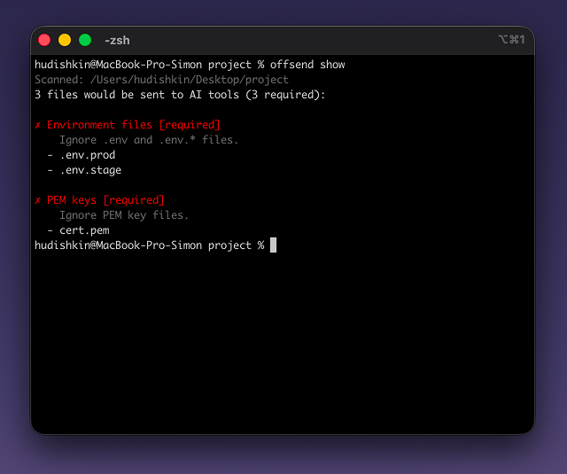
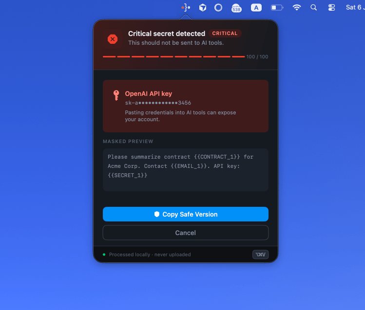
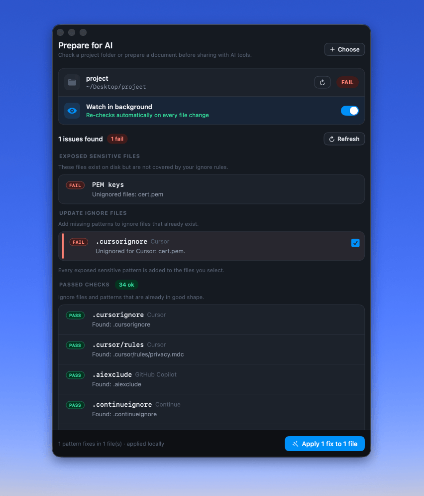

<h1 align="center"><code>*}• Offsend</code></h1>

<p align="center">
  See and fix what AI tools can read.<br>
  Local-first privacy checks for terminals, CI, and macOS — before ChatGPT, Claude, Cursor, Copilot, or Gemini see your context.
</p>

<p align="center">
  <a href="https://offsend.io">Website</a> ·
  <a href="#quick-start">Quick Start</a> ·
  <a href="#cli">CLI</a> ·
  <a href="#macos-app">macOS App</a> ·
  <a href="https://check.offsend.io">Check</a> ·
  <a href="https://offsend.io/extension">Extension</a>
</p>

<p align="center">
  <a href="https://github.com/Offsend/Offsend/actions/workflows/ci.yml"></a>
  <a href="https://github.com/Offsend/Offsend/releases"></a>
  <a href="LICENSE"></a>
  
  <a href="https://www.apple.com/macos/"></a>
  
  
  <a href="https://radar.offsend.io/participants/"></a>
</p>

---

Offsend adds a local review step before sensitive data reaches an AI tool.

- Scanning runs locally on your machine.
- Code and file contents are not uploaded for analysis.
- No cloud account is required.
- The CLI is free and open source.

AI tools need context, but that context can accidentally include API keys, client data, private endpoints, certificates, or config files.

`.gitignore` protects Git. It does not define what AI tools should read.

## Why Offsend

AI workflows create a new boundary problem.

A file does not need to be committed or publicly exposed to become AI context. It can reach an AI tool through a prompt, project index, coding assistant, uploaded document, clipboard, or Git diff.

Offsend helps review that context locally before it leaves your control.

**Platforms:** CLI on macOS and Linux (x86_64 / arm64) · macOS app on macOS 13+ · GitHub Action on Linux and macOS runners.

## Pick your workflow

| Tool | Purpose | Link |
| --- | --- | --- |
| **CLI** | Terminal, git hooks, and CI on **Linux & macOS** (free) | [Quick Start](#quick-start) |
| **macOS app** | Safe Paste, drag-and-drop prep, watched folders | [Desktop](#macos-app) |
| **Check** | Free online scan of a public GitHub repo | [check.offsend.io](https://check.offsend.io) |
| **GitHub Action** | Same CLI checks on every PR / push | [ai-hygiene](https://offsend.io/github-action) |
| **Browser Extension** | Mask secrets in ChatGPT, Claude, Gemini, … | [Extension](https://offsend.io/extension) |
| **Radar** | Research AI-context exposure across public repos | [radar.offsend.io](https://radar.offsend.io) |

**Use the CLI** if you need repository checks, git hooks, CI, or scripts.  
**Use the macOS app** if you regularly prepare files, projects, or clipboard text before sending them to AI.

---

## Quick Start

### Free CLI (macOS + Linux)

```bash
curl -fsSL https://install.offsend.io/cli | bash
offsend doctor
offsend show
```

The package is distributed as `offsend-cli`. After installation, the terminal command is `offsend`.

Example output when sensitive paths are exposed:

```text
Scanned: /path/to/project
3 files would be sent to AI tools (2 required, 1 recommended):

✗ Environment files [required]
    Ignore .env and .env.* files.
  - .env

✗ PEM keys [required]
    Ignore PEM key files.
  - server.pem

! SSH material [recommended]
    Ignore SSH directories and id_rsa files.
  - id_rsa
```

`offsend show` is read-only: it checks paths and ignore rules, not the contents of matched files. Next step:

```bash
offsend prepare
offsend hook install
offsend check --staged
```

### macOS app

```bash
brew install --cask offsend/tap/offsend
```

Or download the latest `.dmg` from [Releases](../../releases).

Open Offsend, drop in a file or project, review findings, mask sensitive data, then copy or save the AI-ready result.

## Contents

- [Pick your workflow](#pick-your-workflow)
- [Quick Start](#quick-start)
- [CLI](#cli)
- [macOS App](#macos-app)
- [More of the Offsend toolkit](#more-of-the-offsend-toolkit)
- [Privacy](#privacy)
- [FAQ](#faq)
- [Docs](#docs)
- [Contributing](#contributing)

---

## CLI

Free for local checks, git hooks, and CI. Runs on **macOS and Linux** (x86_64 and arm64).

<p align="center">
  
</p>

The Homebrew package / cask is `offsend-cli`; the command you run is `offsend`. The macOS app also ships a bundled helper at `Offsend.app/Contents/Helpers/offsend` (install to `PATH` from **Settings → Hooks → CLI** without overwriting an existing Homebrew `offsend`).

### Two types of checks

**Content scanning** — `offsend check` scans selected files or staged changes for API keys, tokens, private keys, personal data, and custom terms.

**AI-context boundary checks** — `offsend show` and `offsend prepare` inspect paths and AI ignore rules to find files that AI tools should probably not read. These directory checks do not read the contents of matched files.

### Commands

| Command | What it does |
| --- | --- |
| `offsend doctor` | Verify the installation |
| `offsend show` | Show sensitive paths visible to AI tools |
| `offsend prepare` | Create missing AI ignore files |
| `offsend check` | Scan files or folders |
| `offsend check --staged` | Scan staged Git changes |
| `offsend hook install` | Install a pre-commit hook |
| `offsend hook status` | Check hook status |
| `offsend hook uninstall` | Remove the hook |
| `offsend init` | Create a starter `.offsend.yml` |

Also available: `offsend seal` / `unseal` (reversible masking tokens), `offsend report`, `offsend keygen`.

### Typical repository workflow

```bash
# 1. See which sensitive paths are visible
offsend show

# 2. Preview missing AI ignore files
offsend prepare --dry-run

# 3. Create them
offsend prepare

# 4. Scan staged changes before a commit
offsend check --staged

# 5. Automate the staged check
offsend hook install
```

### Main use cases

**1. See what AI tools can read**

```bash
offsend show
offsend show --format json
```

Exits `0` even when files are exposed (`2` only if the directory is unavailable). When it surfaces exposed files, run `offsend prepare`.

**2. Generate AI ignore files**

Creates missing ignore files (`.cursorignore`, `.claudeignore`, `.aiexclude`, `.geminiignore`, and similar). Existing files are never overwritten.

```bash
offsend prepare
offsend prepare --dry-run
offsend prepare --sync-patterns   # also append missing sensitive-data patterns
```

**3. Scan files and staged changes**

```bash
offsend check README.md Sources/
offsend check --staged
offsend check --staged --format json --quiet
```

By default the text output is a summary. Add `--verbose` to list every finding and skipped file.

**4. Protect commits with a hook**

```bash
offsend hook install --path /path/to/your/repo
offsend hook status
offsend hook uninstall
```

The hook runs `offsend check --staged` and blocks commits that contain API keys, tokens, private keys, and similar patterns.

**5. CI**

```yaml
- name: Install Offsend CLI
  run: curl -fsSL https://install.offsend.io/cli | bash

- name: Check for secrets
  run: offsend check --staged
```

Or use the packaged action:

```yaml
- uses: actions/checkout@v4
- uses: Offsend/ai-hygiene@v1
  with:
    fail-on: block
```

### Configuration

Tune detectors, exclusions, and hook policy with a committed `.offsend.yml`:

```bash
offsend init
```

```yaml
version: 1

check:
  fail_on: block
  policy: false
  exclude:
    - "*.lock"
    - "vendor/**"
  detectors:
    disable:
      - phone
  dictionaries:
    - kind: project
      value: "Project Apollo"

hooks:
  type: pre-commit
  fail_on: block
  policy: false
```

Full settings reference, detector IDs, and dictionary kinds: **[docs/configuration.md](docs/configuration.md)**.

### Install options

**Homebrew**

```bash
# macOS (signed binary + frameworks)
brew install --cask offsend/tap/offsend-cli

# Linux
brew install offsend/tap/offsend-cli

offsend doctor
```

Pin a release with `OFFSEND_VERSION=0.0.6`, or install without root:

```bash
OFFSEND_INSTALL_DIR=$HOME/.local/bin OFFSEND_PREFIX=$HOME/.local/lib/offsend/cli \
  curl -fsSL https://install.offsend.io/cli | bash
```

**Docker**

```bash
docker build -f CLI/Dockerfile -t offsend/cli .
docker run --rm -v "$PWD:/work" -w /work offsend/cli check README.md
```

**Build from source** — Swift 6.0+, git:

```bash
OFFSEND_CLI_VERSION=0.0.0 bash Scripts/build_linux_cli.sh   # Linux release build
swift build --product offsend -c release                     # any supported host
.build/release/offsend doctor
```

On Linux, config lives under `$XDG_CONFIG_HOME/offsend` (typically `~/.config/offsend`). On macOS CLI, settings use Application Support / Keychain like the app.

---

## macOS App

Interactive workflow for daily work on Mac: Safe Paste, drag-and-drop file preparation, project audits, watched folders, local AI detection, and hook management UI.

<p align="center">
  
</p>

<p align="center">
  
  &nbsp;
  
</p>

### Install

```bash
brew install --cask offsend/tap/offsend
```

Or download the latest `.dmg` from [Releases](../../releases).

**Build from source** — macOS 13+, Xcode 16, Tuist:

```bash
brew install tuist
./Scripts/bootstrap.sh
open Offsend.xcworkspace
```

macOS may ask for Accessibility (to paste into the front app) and folder access (to audit and monitor directories).

### What you can do

**1. Prepare a project**

Check whether a folder is ready for AI coding tools: ignore files, sensitive paths, one-click fixes. Works with `.cursorignore`, `.copilotignore`, `.claudeignore`, `.aiexclude`, and similar rules. Can watch folders in the background and notify you when something changes.

Directory checks use paths and ignore rules only — not file contents.

**2. Prepare files**

Drop a file in **Prepare**, review findings, mask or redact sensitive items, then copy or save an AI-ready version.

Supported formats:

- **Plain text** — `.txt`, `.md`, `.csv`, `.json`, `.log`, `.xml`, `.yaml`, plus other text files (e.g. `.swift`, `.html`)
- **Documents** — `.pdf`, `.rtf`, `.doc`, `.docx`

**3. Safe Paste**

- `⌘⇧V` — scan the clipboard, mask sensitive values, paste or copy the prepared text
- `⌘⇧R` — restore masked values when you need the originals

Mappings are encrypted on disk; the key lives in Keychain. Hotkeys are remappable in Settings.

**4. Git hooks from the UI**

Open **Settings → Hooks**, add a repository, and choose **Install Hook**. Status and uninstall are managed there without editing shell scripts by hand.

From the terminal, use `offsend hook install` (see [CLI](#cli)).

**5. Detection & local AI**

Built-in detectors cover emails, phones, IDs, amounts, URLs, IPs, API keys, tokens, private keys, and similar patterns. Toggle them in **Settings → Detection**. Add **custom dictionaries** (client names, companies, regex patterns) — also available to the CLI via `.offsend.yml`.

Optional local AI models (NER/PII) live in **Settings → AI**. Model files and inference stay on your Mac; Offsend does not upload scanned content for AI detection.

### App vs CLI

| | **CLI (macOS / Linux)** | **macOS app** |
| --- | --- | --- |
| Best for | Terminal, hooks, CI | Daily interactive work |
| Safe Paste | No | Yes |
| File preparation | Path-based scans | Drag-and-drop UI, review, copy/save |
| Documents | Plain text (+ PDF/RTF/Word on macOS CLI) | Plain text, PDF, RTF, Word |
| Project checks | `show`, `prepare`, `check --policy` | UI checks, watched folders |
| Git hooks | `offsend hook …` | Settings → Hooks |
| AI models | Not used by the CLI | Download / import / manage |
| Automation | Scriptable text / JSON | Background watcher + notifications |

### Free vs Pro

The core protection workflow is free. Pro adds convenience for heavier daily use: unlimited watched folders and longer restore windows.

| | **Free** | **Pro** |
| --- | --- | --- |
| Safe Paste & built-in detectors | Unlimited | Unlimited |
| Directory audit & one-click fixes | Full | Full |
| CLI for terminal, hooks & CI | Yes | Yes |
| Hook management UI | Yes | Yes |
| Custom dictionaries (incl. regex) | Yes | Yes |
| Watched folders | 1 | Unlimited |
| Mapping TTL | 1 hour | Up to 24 hours |

---

## More of the Offsend toolkit

Same idea on every surface: see what AI can read, then fix it.

### [Check](https://check.offsend.io) — scan a GitHub repo online

Paste a public GitHub URL. Get exposed secrets, risky configs, and missing AI ignore rules — no signup. Full file paths stay hidden in the report.

### [GitHub Action](https://offsend.io/github-action) — CI gate

[`Offsend/ai-hygiene`](https://github.com/Offsend/ai-hygiene) installs the CLI and runs `offsend check` on pull requests and pushes. Tune with the same `.offsend.yml` as local runs.

### [Browser Extension](https://offsend.io/extension) — protect prompts

Chrome / Firefox extension that scans ChatGPT, Claude, Gemini, Grok, Perplexity, and DeepSeek prompts locally before send. Mask with placeholders like `{{API_KEY_1}}`, or warn / block.

### [Radar](https://radar.offsend.io) — exposure research

Tracks AI-context risk signals across public repositories without reading file contents or publishing exact paths.

---

## Privacy

Offsend is designed to keep scanning on your device.

- File and clipboard scanning runs locally.
- Project audits inspect paths and ignore rules locally.
- Offsend does not upload scanned file contents, prompts, clipboard payloads, findings, or detected values.
- Restore mappings are encrypted on disk; the key is stored in Keychain (macOS).
- Optional local AI models run on your Mac.
- No cloud account is required.

The macOS app runs locally on your Mac. The standalone CLI supports local and CI workflows on macOS and Linux. Check only analyzes a GitHub repo you choose to scan online.

For vulnerability reports, see [SECURITY.md](SECURITY.md).

---

## FAQ

**Does Offsend upload my code?**  
No. Scanning in the macOS app and CLI runs locally. Check only analyzes a GitHub repo you choose to scan online.

**Is the CLI free?**  
Yes. The standalone CLI is free for terminal checks, git hooks, scripts, and CI.

**Does Offsend replace `.gitignore`?**  
No. `.gitignore` controls Git. Offsend also helps create ignore rules used by AI coding tools (`.cursorignore`, `.claudeignore`, …).

**Is Offsend a secret scanner?**  
Partly. It detects secrets and sensitive data, but it also checks AI-context boundaries: which files AI tools can read and whether appropriate AI ignore rules exist.

**Does `offsend show` read file contents?**  
No. It evaluates file paths and ignore rules. Content scanning is performed separately by `offsend check`.

**Which platforms are supported?**  
macOS app: macOS 13+. CLI: macOS and Linux (x86_64 and arm64). GitHub Action: Linux and macOS runners.

**Which AI tools are supported?**  
Any tool that respects common AI ignore files, plus browser chats covered by the extension (ChatGPT, Claude, Gemini, and others). The CLI and app are tool-agnostic.

---

## Docs

- [Configuration (`.offsend.yml`)](docs/configuration.md)
- [Security](SECURITY.md)

---

## Contributing

Bug reports, feature requests, documentation improvements, and pull requests are welcome.

- Open an [issue](https://github.com/Offsend/Offsend/issues)
- Read [SECURITY.md](SECURITY.md) before reporting a vulnerability
- Keep changes focused and explain the user problem they solve

---

## License

Apache 2.0 — see [LICENSE](LICENSE).
