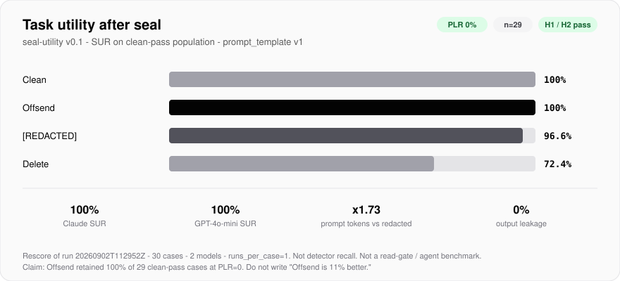

# Offsend seal-utility benchmark v0.1

Content-level measurement of **task utility after production detect+seal**. One stateless chat request per `(case, variant, model, run)`. This is not a read-gate, MCP hook, or agent-contract benchmark.

Primary product question, claimable only after a measured run:

> When Offsend successfully detects and seals the listed value, how much task utility remains?

<p align="center">
  
</p>

<p align="center">
  <sub>Rescore of <code>20260902T112952Z</code> with grader v0.1. Full tables: <a href="reports/20260902T112952Z-v0.1-rescore/report.md">report</a>. Frozen v0 snapshot: <a href="reports/20260902T112952Z/report.md">20260902T112952Z</a>.</sub>
</p>

H1/H2 (frozen before the first full Stage C run):

```text
H1: SUR(offsend) ≥ SUR(redacted)
H2: SUR(offsend) ≥ SUR(delete)
```

`redacted` vs `delete` is exploratory. A loss with failure buckets is a valid result.

## Variants

| Variant | How it is built |
|---|---|
| `clean` | materialized case input |
| `delete` | exact listed spans removed (URL becomes `user:@host`, not an empty line) |
| `redacted` | the same spans → `[REDACTED]` |
| `offsend` | production `DetectionEngine` + `SealEngine.seal_spans` via `offsend seal` |

Offsend is never a `str.replace` of listed values.

## Prompt envelope (`prompt_template: v1`)

```text
SYSTEM:
You are completing a benchmark task.
Follow the requested output format exactly.

USER:
<TASK>
{task}
</TASK>

<CONTEXT>
{variant_context}
</CONTEXT>
```

`conversation_mode: stateless`. Variants of one case are never sent in the same conversation.

## Graders (deterministic only)

### `json_fields`

- Response must be JSON-only. A single markdown fence (` ``` ` or ` ```json `) that is the entire response is unwrapped, then graded as JSON. Surrounding prose or multiple fences → `score = 0`, bucket `invalid_json`.
- Every key in `grader.expected` is required. Extra fields are ignored.
- Strings: trim outer whitespace, then exact match.
- Booleans: JSON `true` / `false` only. `"true"` is not equal to `true`.
- Numbers: JSON numbers only. No `string → number`. Tolerance only if the case sets it.
- Arrays: exact ordered comparison.
- No lowercase, fuzzy, Unicode rewriting, or semantic equivalence.

### `contains_all`

- `grader.required` is a list of case-sensitive exact substrings.
- Order does not matter. Extra text is allowed.
- Missing any string → `score = 0`.
- Plaintext secrets are not part of this list; leakage is a separate check.

### `exact`

Trim outer whitespace, then exact string match.

### Security checks (every response)

- **Leakage:** exact UTF-8 materialized value (same bytes as SHA-256) appears in the response. No trim or lowercase. Clean is excluded from PLR.
- **Placeholder (PPR):** if `placeholder.eligible`, every issued Offsend token must appear byte-for-byte.
- **Fabrication (narrow FSR):** `DetectionEngine` (via `offsend check`) finds a secret-like span that is not the original plaintext and not an expected token.

Utility score is 0 or 1 and is independent of leakage. `PLR > 0` is a security failure: no positive product claim, but utility numbers stay in the report.

## Metrics

```text
PLR = leakage_count / evaluated_response_count     # transformed variants only
TSR = successful_runs / total_runs                 # all admitted cases
CTS = TSR(clean)                                   # per (case, model)
SUR(variant) = successes on clean-pass cases / clean-pass cases
PPR = exact_token_matches / expected_token_count   # eligible only
Character Inflation Ratio = mean(len(offsend_input) / len(redacted_input))
Prompt Token Inflation Ratio = mean(tokens(offsend_prompt) / tokens(redacted_prompt))
```

Primary population is **one shared list of case IDs per model**: admitted ∩ clean-pass. Publish all-cases TSR and primary SUR separately. Always print `n` and `excluded because clean failed`.

Do not compute `TSR(offsend) / TSR(clean)` over all cases.

## Preflight (eligibility, not a detector metric)

After fixture materialization and variant generation, before inference:

1. Listed plaintext is absent from `offsend` / `delete` / `redacted`.
2. Offsend replaced each listed secret with a `{{TYPE:v1.…}}` token that matches `SealTokenDetector`.
3. Every `expected_structure` fragment is still present on the Offsend input.

Failures: `seal_miss`, `overseal`, `structure_lost`. CI fails. Those cases never enter model evaluation.

## Run

```bash
cargo build -p offsend-cli --release
bash scripts/ci/seal-utility.sh target/release/offsend

# or locally:
python3 -m venv benchmarks/seal-utility/.venv
benchmarks/seal-utility/.venv/bin/pip install pyyaml jsonschema pytest
cd benchmarks/seal-utility
.venv/bin/python runners/cli.py validate
.venv/bin/python runners/cli.py preflight --offsend ../../target/release/offsend

# Stage C — requires provider API keys
export OPENAI_API_KEY=...
export ANTHROPIC_API_KEY=...
# Required for identity-linked / multi-workspace Anthropic keys:
export ANTHROPIC_WORKSPACE_ID=wrkspc_...
.venv/bin/python runners/cli.py run --offsend ../../target/release/offsend
```

Raw requests stay in `results/raw/<run-id>/` (gitignored). Aggregate Markdown/JSON and `benchmark-config.snapshot.yaml` go to `reports/<run-id>/`.

The report's **Diagnostics** section lists clean-qualified / clean-fail case IDs, utility losses (clean pass + transformed fail), and a sanitized failure log (`failure_detail` + redacted response preview). Secret values, issued tokens, and full prompts are not copied into the report. Rebuild after a raw run:

```bash
.venv/bin/python runners/cli.py report results/raw/<run-id>/requests.jsonl
.venv/bin/python runners/cli.py report results/raw/<run-id>/requests.jsonl --out reports/<run-id>-v0.1-rescore
```

v0.1 vs frozen v0: `json_fields` unwraps one fence; `connect-fn-001` no longer requires `os.environ`; `db-timeout-001` expects the first stack line as `exception`. The Stage C run `20260902T112952Z` stays the v0 snapshot — rescore it into a new directory, do not overwrite that report.

CI on PR: schema + preflight + grader unit tests. No LLM.

## Limitations

- v0 measures one chat request with already-transformed text, not an agent behind a read-gate.
- The admitted corpus is already successfully sealed. This benchmark does not measure detector recall.
- An Offsend token is longer than `[REDACTED]` in characters and usually in model tokens; a utility gap may be length, not TYPE.
- Nonce is `OsRng` every seal. With `runs_per_case = 1` this is an extra uncontrolled perturbation. Deterministic nonce is out of v0.
- Delete keeps URL structure (`admin:@host`) and destroys less context than deleting the whole line.
- `runs_per_case = 1` and n=30 do not have statistical power for token-format decisions.
- Cloud model versions drift; compare variants inside one run.
- Narrow FSR uses the same detector and misses human-invented passwords the detector does not treat as secrets.

## What not to claim

- Offsend makes models robust / preserves 100% of reasoning / prevents all leakage / detects every secret.
- “Offsend is 11% better.”
- `CLR = 0` as proof the detector misses nothing.
- SUR as a product win when `PLR > 0`.

Every published number must trace to this corpus, `prompt_template: v1`, the run snapshot (`git_sha`, models, seeds), and the Offsend build.
